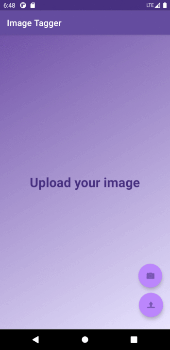

# ImageTagger
## AI-based Android app for automated image tagging

This project demonstrates AI-based Android app, that allows to generate tags given an image.

### Motivation & Summary

The amount of visual information - such as photos and social media images - has been getting bigger exponentially over past decades, motivating the development of software that can effectively handle high-volume image collections.
Specifically, the ability to generate relevant textual labels for images can help users to eliminate manual image processing, automate image labeling (ex. web content tagging, online catalogs) and potentially benefit existing applications that imply organization of high-volume imaging data (ex. image managers), image search and sharing (ex. recommendation engines).

One of the technologies that utilizes image classification to generate descriptive tags based on visual representations of images is called image tagging.
This project demonstrates ImageTagger, an Android app that automatically generates relevant textual annotations of user images. 

The final Android app allows users to upload an image that they would like to have described and to get relevant tags for the given image.
ImageTagger makes a user possible to update existing and to add new tags to an image.
Over time, the system learns tags from the new input images in an online manner based on the explicit user's feedback and gets better at predicting descriptions on its own.

### Results & Conclusions

In order to address the tag generator implementation task, a general purpose image classification dataset [Tiny ImageNet](http://cs231n.stanford.edu/reports/2017/pdfs/930.pdf) was used. 
The dataset contains more than 100k images with descriptive labels corresponding to different 200 classes (animals, devices, clothes, etc.), enabling the model to learn representations and descriptions of images from different knowledge domains.
In order to assess the model's performance, accuracy score was calculated on the validation subset of the Tiny ImageNet dataset.

Here, a combination of deep learning and classical machine learning techniques have been applied.
The overall analysis can be split into two steps, namely feature extraction and classification. 
The feature extraction part was implemented using deep convolutional neural network [MobileNet V2](https://arxiv.org/abs/1801.04381), while the labels to be assigned were calculated using a Gaussian naive Bayes classifier. 
Given a cumulative probability threshold of 0.9, the aforementioned combination of methods was used to produce a set of most relevant tags for the input image. 
 
 
As deep neural networks are quite computationally expensive, the inference speed becomes usually a bottleneck. 
To address this issue and increase the model’s throughput, the approach called model quantization was applied. 
This improvement allowed to substantially reduce the time needed to perform the feature extraction step (from 212.0 +/- 12.6 ms to 50.1 +/- 9.1 ms on Nokia 7.1) for the cost of a marginal decrease of the validation accuracy (from 56.09% to 55.67%). 

Therefore, the developed ImageTagger Android app allows to automatically generate relevant textual annotations of user images.
The further accuracy improvement can be achieved considering training on a larger dataset (e.g. ImageNet, YFCC100M). 
Additionally, the model speed can benefit by the usage of modern devices that support GPU-based inference.

### Structure
The following Python modules demonstrate how to process the data, train and evaluate the model, generate statistics of embeddings that are used by ImageTagger: 

1. **Data Processing & Computer Vision Pipelines:** 
`utils/process_data.py` file provides the script that:

    - Loads and prepares folder structure for the downloaded dataset
    - Processes the images
    - Builds a pre-trained multi-class model and optimizes it for mobile devices
    - Generates embeddings from images and extracts per-class statistics
    - Exports the pre-trained model and the corresponding per-class statistics

2. **Evaluation of model performance:** 
`utils/eval_model.py` file provides the script that: 

    - Enables to train and evaluate the model on different subsets of data
    - Displays performance metrics for the pre-trained model as top-1/-5/-10 accuracy results 

### Instructions

**Installing Android App:**
In order to run the ImageTagger app on your Android device follow the instructions:

1. Download the release [file](https://github.com/slipnitskaya/image-tagger/releases/download/v1.0-alpha/image-tagger-v1.0-alpha.apk) to your Android device.

2. Open the app on your Android device

3. Enjoy the automatic image tagging!

**Run Python Code:** 

In order to run the data processing and computer vision pipelines clone this repository to your local machine and follow the instructions:
 
1. Go to the project's root directory:
    - Run in your shell:
        
        `cd <project_root_directory>`

2. Download the Tiny ImageNet dataset into `<project_root_directory>/utils` folder manually or run the following commands:  
    The dataset file can be downloaded and extracted manually from [link](http://cs231n.stanford.edu/tiny-imagenet-200.zip) or, alternatively, using the following code:

    - Download the dataset and extract files from the uploaded file into `<project_root_directory>/utils` folder:
        
        `cd utils`
        
        `wget http://cs231n.stanford.edu/tiny-imagenet-200.zip`
        
        `unzip tiny-imagenet-200.zip`
    
3. Run the following commands in the `utils` directory to set up the database and the model:

    - To run the data processing and ML pipelines that prepare the data and generate embeddings
        
        `python -m process_data -d tiny-imagenet-200 -m mobilenet_v2`

4. Run the following commands in the `utils` directory to evaluate the model performance:

    - To generate embeddings for the validation subset:
        
        `python -m process_data -d tiny-imagenet-200 -m mobilenet_v2 -v`
    - To display performance metrics of the model:
        
        `python -m evaluate_model -m mobilenet_v2 -i generated -o results`

### Software requirements
**Android:** Android 8.1 and above; installation of APKs from Unknown Sources should be allowed.

**Python:** `requirements.txt` file provides libraries required for the successful start of Python code

### Hardware requirements
NVIDIA GPU supporting [CUDA compute capability 6.0 and higher](https://developer.nvidia.com/cuda-gpus).

### License
Except as otherwise noted, the content of this repository is licensed under the [Creative Commons Attribution Non Commercial 4.0 International](https://creativecommons.org/licenses/by-nc/4.0/legalcode), and code samples are licensed under the [Apache 2.0 License](https://www.apache.org/licenses/LICENSE-2.0). All materials can be freely used, distributed and adapted for non-commercial purposes only, given appropriate attribution to the licensor and/or the reference to this repository.

SPDX-License-Identifier: CC-BY-NC-4.0 AND Apache-2.0
